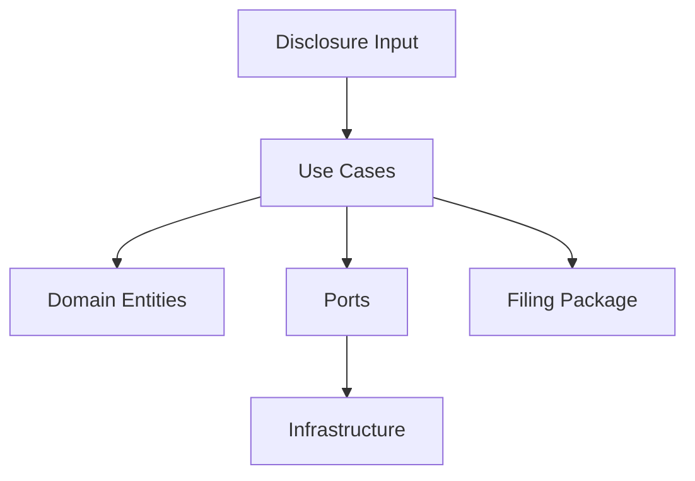

# Architecture

This repo uses Clean Architecture to keep patent logic stable and infrastructure replaceable.

## Dependency Rule
- Domain knows nothing about frameworks or storage
- Use cases depend only on domain and ports
- Adapters define interfaces used by use cases
- Infrastructure implements adapters and can be swapped

## Core Flow

## State Machine
- Draft -> Review -> Final -> Filed
- Invalid transitions are blocked in `WorkflowEngine`

## Auditability
- Every artifact is versioned per filing package
- Reviews are first-class entities
- Storage keys include invention id and version
